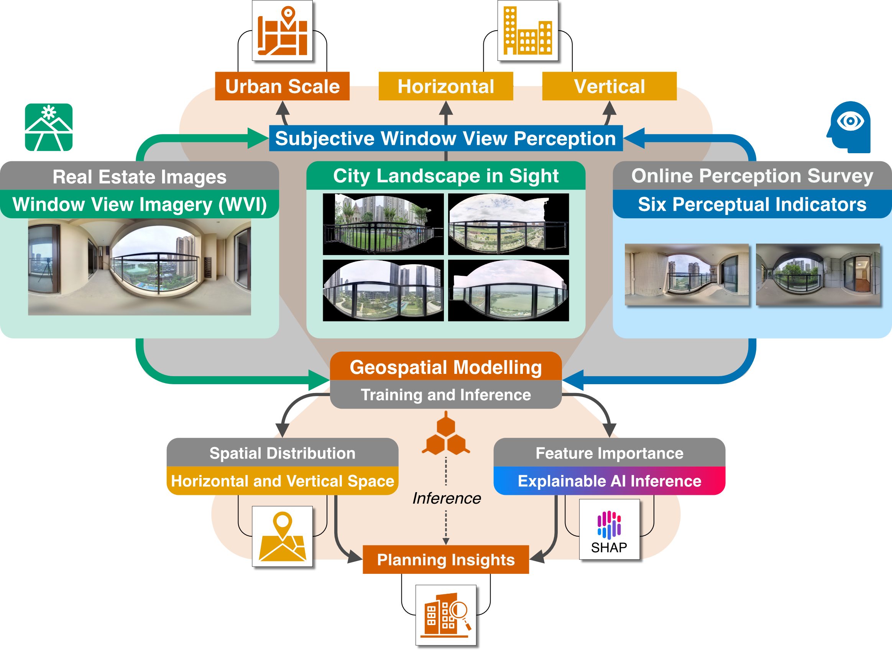

# <div align="center">City Landscape In Sight: A Crowdsourced Framework for Unlocking Urban-Scale Window View Perceptions from Real Estate Imagery</div>

<div align="center">

**[Chucai Peng](https://ual.sg/author/chucai-peng/)**<sup>1,2,†</sup>, **[Sijie Yang](https://sijie-yang.com)**<sup>1,3,†</sup>, **Ang Liu**<sup>4</sup>, **Yang Xiang**<sup>5</sup>, **Zhixiang Zhou**<sup>2</sup>, **[Filip Biljecki](https://filipbiljecki.com)**<sup>1,6,*</sup>

<sup>1</sup> Department of Architecture, National University of Singapore  
<sup>2</sup> College of Horticulture and Forestry Sciences, Huazhong Agricultural University, Wuhan, China  
<sup>3</sup> School of Engineering and Applied Science, University of Pennsylvania, Philadelphia, USA  
<sup>4</sup> Department of Political Science, Rutgers University, Newark, USA  
<sup>5</sup> School of Arts and Communication, China University of Geosciences, Wuhan, China  
<sup>6</sup> Department of Real Estate, National University of Singapore  
<sup>†</sup> Co-first authors &nbsp;|&nbsp; <sup>*</sup> Corresponding author: filip@nus.edu.sg

</div>

<div align="center">

[](https://creativecommons.org/licenses/by/4.0/)

</div>

<div align="center">
<div style="display: flex; justify-content: center; align-items: center; gap: 20px;">


</div>
<a href="https://ual.sg">Urban Analytics Lab</a> | National University of Singapore
</div>

---

<div align="center">

</div>

## Overview

This repository contains the code and data for a crowdsourced framework that leverages real estate imagery to capture urban-scale window view perceptions (WVI). The framework combines crowdsourced perception surveys, machine learning models, and geospatial analytics to quantify and analyze how people perceive urban window views across a city.

## Repository structure

```
├── code_1_wvi_perception_survey_results.ipynb        # Crowdsourced survey + TrueSkill ranking
├── code_2_wvi_preprocess_visual_features.ipynb     # Mask/crop/resize + visual feature extraction
├── code_3_wvi_dataset_sampling.ipynb               # Hexagon_ID & Complex_ID for spatial sampling
├── code_4_wvi_perception_data_analytics.ipynb      # Urban-scale WVI perception analytics
├── code_5_wvi_perception_model_train_predict.ipynb # ResNet-50 + tabular-features regression
├── code_6_wvi_perception_inference_analytics.ipynb # Classical-regressor benchmark vs. deep model
├── assets/                                         # Logos and abstract figure
├── data/
│   ├── data.csv                                    # Scores + geospatial features + Hexagon/Complex ID
│   ├── data_final_rescaled.csv                     # Rescaled (0–5, top 5% capped) for analytics
│   ├── metadata/complex_id_map.csv                 # Lon/Lat → Complex_ID lookup
│   ├── perception_survey/
│   │   ├── raw/{dimension}.csv                     # Pairwise comparisons (input to Code 1)
│   │   └── ranked/ranked_{dimension}.csv           # TrueSkill ratings (written by Code 1)
│   ├── training_features/
│   │   ├── Features.csv                            # Training visual + structural features (Code 2)
│   │   ├── TrainingFeatures_{dimension}.csv        # Features + TrueSkill score (Code 1 → Code 3)
│   │   └── kfold_splits/                           # Frozen 5-fold splits (optional; see README there)
│   ├── inference_features/Features.csv             # City-scale visual features (Code 2)
│   ├── inference_predictions/predictions_{dim}.csv # Per-dimension city-scale predictions (Code 3)
│   ├── training_images/                            # 499 training WVIs (local; not in git)
│   │   └── WVI_Original/ | WVI_Segmentation/ | WVI_Processed/
│   └── inference_images/                           # City-scale WVIs (local; not in git)
│       └── WVI_Original/ | WVI_Segmentation/ | WVI_Processed/
├── figures/                                        # Generated figures (PNG/SVG)
└── model_outputs/                                  # Metrics, CV summaries, training logs (Code 3)
```

**Perception dimensions** (used consistently across notebooks): `prefer`, `monotonous`, `quiet`, `extensive`, `vivid`, `oppressive`.

## Usage

Each `.ipynb` notebook can be run independently. For a full reproduction, run them in order **1 → 2 → … → 6**:

| Step | Notebook | Role |
|------|----------|------|
| 1 | `code_1_wvi_perception_survey_results.ipynb` | Load pairwise records from `raw/`, run TrueSkill, write `ranked/` and `TrainingFeatures_*.csv` |
| 2 | `code_2_wvi_preprocess_visual_features.ipynb` | Pre-process images and extract color features for training and inference sets |
| 3 | `code_3_wvi_dataset_sampling.ipynb` | Assign `Hexagon_ID` and `Complex_ID` to `data/data.csv` |
| 4 | `code_4_wvi_perception_data_analytics.ipynb` | Distribution, clustering, spatial autocorrelation, and hot-spot analysis |
| 5 | `code_5_wvi_perception_model_train_predict.ipynb` | Train ResNet-50 + feature regression, K-fold benchmark, city-scale inference |
| 6 | `code_6_wvi_perception_inference_analytics.ipynb` | Benchmark classical regressors against the deep model (test R² / RMSE per dimension) |

**Suggested path after Code 2:** Code 1 (labels) → Code 5 → Code 3 → Code 4/6.

### Requirements

Python 3.10+ recommended. Core dependencies used across notebooks:

`numpy`, `pandas`, `matplotlib`, `seaborn`, `scikit-learn`, `trueskill`, `torch`, `torchvision`, `Pillow`, `tqdm`

Install example:

```bash
pip install numpy pandas matplotlib seaborn scikit-learn trueskill torch torchvision pillow tqdm
```

Code 2 invokes helper scripts under `scripts/` when run locally (`masked.py`, `masked_cut.py`, `data_mini.py`). Those scripts are not part of the public release (see `.gitignore`); equivalent steps are documented in the Code 2 notebook.

### Model checkpoints

Training writes `model_outputs/best_model_{dimension}.pth` (~94 MB each). These files are listed in `.gitignore` because of GitHub size limits; **re-run Code 3** to regenerate them, or use weights from the paper’s data release if provided separately.

## Data

| Path | Description |
|------|-------------|
| `data/data.csv` | Main analytics table: predicted perception scores and geospatial features per WVI |
| `data/data_final_rescaled.csv` | Rescaled scores (0–5, top 5% capped); written/used by Code 4 |
| `data/perception_survey/raw/{dimension}.csv` | Pairwise survey records |
| `data/perception_survey/ranked/ranked_{dimension}.csv` | Per-image TrueSkill ratings (μ, σ, 0–10 score) |
| `data/training_features/Features.csv` | Training-set visual features |
| `data/inference_features/Features.csv` | City-scale inference visual features |
| `data/training_features/TrainingFeatures_{dimension}.csv` | Features merged with TrueSkill scores for training |
| `data/inference_predictions/predictions_{dimension}.csv` | City-scale model outputs |
| `data/training_images/WVI_Processed/` | 256 px masked + cropped training images |

## License

This work is licensed under a [Creative Commons Attribution 4.0 International License](https://creativecommons.org/licenses/by/4.0/).
